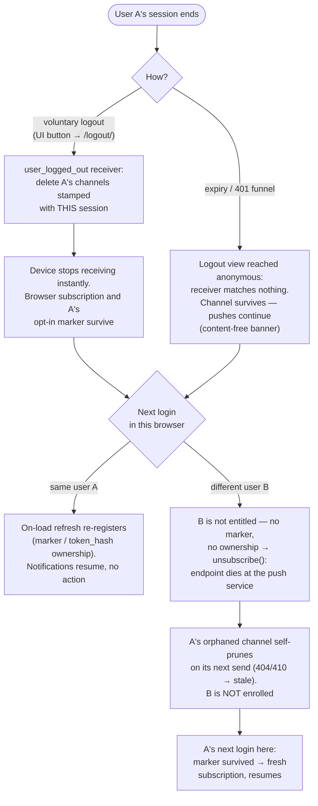
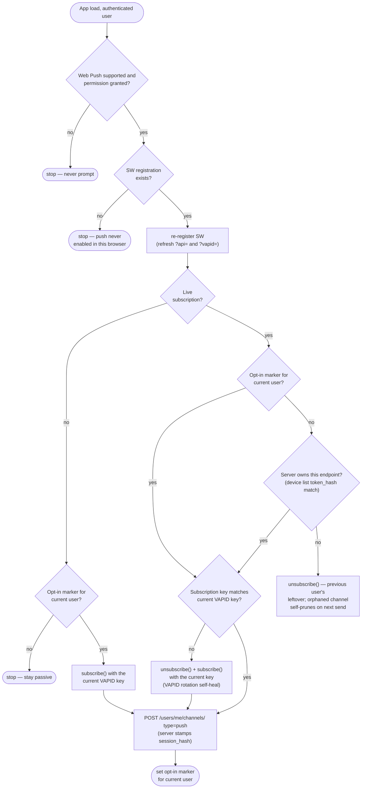

# Push notifications

How push notifications work in this project: the storage and registration model,
the delivery pipeline, the Web Push browser client, the notification settings UI,
and how a native (Capacitor) client integrates through the same API.

The backend (all three transports — APNs / FCM / Web Push), the
device-registration API, device management, the Web Push browser/PWA client and
the native (Capacitor) iOS/Android client are implemented. The native client
(`src/frontend/src/features/native/push.ts`) registers through the same
`POST /users/me/channels/` and is served by the same senders; the per-platform
project config (APNs entitlement, loc-key strings, Android permission,
conditional google-services) ships in the `ios/` / `android/` projects, and
operators supply the per-instance credentials (§3, §12).

---

## 1. Storage & registration

- A device is a **user-scoped** `Channel(type="push")`. The opaque token lives
  encrypted in `encrypted_settings.token` (+ `keys` for Web Push); `settings`
  holds `platform` and `app_version`; the dedup/reclaim key is the indexed,
  globally-unique `Channel.lookup_hash` column (sha256 of the `push:`-prefixed token).
- **Register / refresh:** `POST /api/v1.0/users/me/channels/` with `{type:
  "push", platform, token, keys?, name?, app_version?}`. The collection POST
  routes `type=push` to an idempotent upsert (201 first time, 200 on refresh);
  reclaims a token from another user on account switch. 404 when `PUSH_ENABLED`
  is off. Throttled per user.
- **List / revoke:** the normal `GET`/`DELETE /api/v1.0/users/me/channels/`.
  Push channels are blocked from create/PATCH through the generic endpoint.
- **`platform` is a transport, not an OS:** `apns` / `fcm` / `web`. The OS label
  is a frontend concern carried in the channel `name`, never inferred from `platform`.
- **Payloads carry no message content:** only `{type, thread_id, message_id,
  mailbox_id, unread_count}` (routing ids + badge). The device wakes and
  refetches over its authenticated session — the push never carries
  subject/body/sender. Note only Web Push is end-to-end encrypted (RFC 8291); for
  APNs/FCM those routing ids and the count are visible to Apple/Google in
  transit, the content never is.
- Push is the **app-closed** half of notifications; the realtime SSE relay is
  the **app-open** half. They must cooperate (see §6).

---

## 2. The core idea: one frontend, three transports

The same React app runs in three runtimes; each yields a different transport
that maps 1:1 onto a backend sender:

| Runtime | Token source | `platform` | Backend sender |
|---|---|---|---|
| Capacitor **iOS** (native) | `@capacitor/push-notifications` → **APNs** device token | `apns` | `send_apns` |
| Capacitor **Android** (native) | `@capacitor/push-notifications` → **FCM** registration token | `fcm` | `send_fcm` |
| **Browser / installed PWA** | Web Push API (`PushManager.subscribe`) | `web` | `send_webpush` |

Pick the path at runtime:

```ts
import { Capacitor } from "@capacitor/core";

const transport = Capacitor.isNativePlatform()
  ? (Capacitor.getPlatform() === "ios" ? "apns" : "fcm")
  : "web";
```

Notes:
- `@capacitor/push-notifications` returns the **APNs** token on iOS and the
  **FCM** token on Android out of the box — which is exactly our two native
  transports. (Don't reach for `@capacitor-firebase/messaging` unless you want
  FCM on iOS too; we don't.)
- **iOS WKWebView does not support the Web Push API.** Inside the native iOS
  shell you must use the native plugin (`apns`); `web` is only for real
  browsers / installed PWAs. Android WebView likewise: use the native plugin.

---

## 3. Configuration & client requirements

### `/config` exposes push capability + the VAPID public key
`/config` exposes:
- `PUSH_ENABLED` (bool) — so the UI shows/hides notification controls instead
  of probing the registration endpoint and reacting to a 404.
- `PUSH_VAPID_PUBLIC_KEY` (base64url string) — **required** for the browser to
  call `PushManager.subscribe({ applicationServerKey })`. It's public by
  definition. Derive it once from `PUSH_VAPID_PRIVATE_KEY` with the
  `derive_vapid_public_key` management command and pin the printed value in this
  env var — `/config` serves it verbatim and never derives it on the request
  path (that would force the web worker to import the push/crypto graph). Without
  it, web push cannot work. See §12 for the full operator checklist.

Native (`apns`/`fcm`) needs neither — the OS plugins carry their own creds
(APNs entitlement, bundled `google-services.json`).

### Client-side localization strings (native client)
The senders emit a **visible, high-priority, content-free** alert (it survives
force-quit, where a silent background push would be throttled and dropped).
Because the push carries only localization *keys* — never message content — the
native apps ship the matching strings so the OS can render the banner:
- **iOS:** the alert carries `alert.loc-key = "NEW_MESSAGE"` + the unread badge;
  the matching `Localizable.strings` entries ship in
  `ios/App/App/{en,fr}.lproj/`.
- **Android:** the FCM message carries an OS-localized `notification` block
  (`title_loc_key` / `body_loc_key`); the matching `new_message_*` entries ship
  in `android/app/src/main/res/values{,-fr}/strings.xml`. The OS displays it
  automatically even when the app is killed. It renders on the `new_messages`
  notification channel — created at HIGH importance by the app
  (`ensureAndroidNotificationChannel`, features/native/push.ts), targeted by
  `channel_id` in the message (`FCM_ANDROID_CHANNEL_ID`, fcm.py) and declared
  as manifest default, with the monochrome `ic_stat_notification` status icon.
  Without it Android 8+ would fall back to the SDK's "Miscellaneous" channel at
  DEFAULT importance (no heads-up).

No server toggle is involved — visible alerts are the built-in behavior; if the
loc-key strings are missing the banner renders blank. (The Web Push client needs
no such strings: the service worker renders the banner text itself.)

### Native app project config (native client)
- iOS — in the repo: the Push Notifications capability
  (`ios/App/App/App.entitlements`, `aps-environment = development` — Xcode's
  distribution export rewrites it to `production`) and Background Modes (remote
  notifications, `Info.plist`). Operator-supplied: an APNs auth key (`.p8`) →
  `PUSH_APNS_KEY/_KEY_ID/_TEAM_ID`, bundle id → `PUSH_APNS_BUNDLE_ID` (the App
  ID must have the Push capability enabled in the Apple developer portal).
  `PUSH_APNS_USE_SANDBOX` must match the build's signing: `True` for
  development-signed builds (`aps-environment = development`), `False` for
  distribution.
- Android — in the repo: the `POST_NOTIFICATIONS` permission and a conditional
  `com.google.gms.google-services` apply (skipped with a log when the file is
  absent, so push-less builds still work). Operator-supplied: the Firebase
  project's `google-services.json` dropped into `android/app/` (gitignored,
  per-instance like `MOBILE_APP_ID`) — it must contain a client whose package
  name equals the build's `applicationId` (`MOBILE_APP_ID`), or the build
  fails at the google-services step; service-account JSON →
  `PUSH_FCM_CREDENTIALS`, project id → `PUSH_FCM_PROJECT_ID`. (No sandbox
  switch — staging is a separate Firebase project.)

Developer-facing walkthrough (dev Firebase project, sandbox pairing, smoke
test): [mobile.md](./mobile.md), *Push notifications in dev*.

### Auth inside the WebView (native client — not push-specific, but a dependency)
The app authenticates via OIDC and calls the API with cookies + CSRF. In a
Capacitor shell the app origin is `capacitor://localhost` / `https://localhost`
while the API is remote, so session cookies are cross-site: they need
`SameSite=None; Secure`, and the OAuth round-trip must go through the system
browser (`ASWebAuthenticationSession` / Chrome Custom Tabs) with a deep-link
redirect back. This is a prerequisite for the native client, independent of push.

---

## 4. Registration lifecycle (client)

1. **Ask for permission contextually** — not on first launch. Tie it to a value
   moment or an explicit "Enable notifications" toggle (§5). Browsers penalize
   prompt-on-load; iOS only lets you ask once.
2. **Get the token:**
   - native: `PushNotifications.register()` → `registration` event → token.
   - web: register the service worker, then
     `reg.pushManager.subscribe({ userVisibleOnly: true, applicationServerKey })`
     where the key is `PUSH_VAPID_PUBLIC_KEY` from `/config`. Send the
     subscription `endpoint` as `token` and `{p256dh, auth}` as `keys`.
3. **Register:** `POST /users/me/channels/` with `{type: "push", platform,
   token, keys?, name, app_version}`. Use a human device name
   (`@capacitor/device` → model). **Store the registered *token* locally** —
   device sign-out (§7) recognises this device's server row by comparing
   `sha256("push:" + token)` to the row's `token_hash`. Nothing needs storing
   for logout: revocation there is server-side (step 5).
4. **Re-register** whenever the token rotates (`registration` again / web
   `pushsubscriptionchange`), and on launch as a cheap idempotent refresh. Note
   this is a client convention, not an OS guarantee — the platforms don't *force*
   a per-launch round-trip; re-registering is just the most reliable way to catch
   a silently-rotated token (strongest on iOS, optional on Android/Web).
5. **On logout:** handled *server-side*. Each registration stamps the channel
   with a hash of the registering Django session; the `user_logged_out` receiver
   (`core/signals.py`) deletes the channels bound to the session being destroyed.
   So a **voluntary logout** silences exactly that device — even if no client
   code runs — while a session that merely **expires** never reaches the logout
   view authenticated, so its channels survive and notifications keep flowing
   (content-free banner until the next login re-authenticates enrichment).
   Clients therefore do NOT need to `DELETE` or `unsubscribe()` at logout; the
   re-registration on next login (step 4) transparently resumes delivery. The
   full decision tree (incl. shared-computer takeover) is diagrammed in §12 →
   *Web Push specifics* → *Web session lifecycle — flow*.

---

## 5. Receiving, displaying, deep-linking

- **Tap → deep link:** the payload carries `thread_id` / `message_id`; route to
  the thread on notification open. Register the tap handler
  (`pushNotificationActionPerformed` / SW `notificationclick`).
- **Badge:** from `unread_count` (set as `aps.badge` on the iOS alert path; app
  sets it on Android/Web where supported).
- **Richer content without weakening privacy (fetch-to-enrich):** the thin push +
  `mutable-content: 1` supports a **fetch-to-enrich** flow — the client fetches
  the message over the authenticated session and *rewrites* the banner with
  sender/subject, keeping content off the push transport. The **Web Push service
  worker does this today** (it fetches `/api/v1.0/messages/{id}` and falls back to
  a generic banner if the fetch fails). The native equivalent — an iOS
  Notification Service Extension / Android data handler — is the same pattern for
  the native client.

---

## 6. Cooperation with the realtime SSE relay

When the app is **open** and in front of the user, it surfaces the mail on its
own (today the 30s mailbox poll; the SSE relay when it lands) — a banner for it
is noise. So no transport alerts while the app holds the foreground; only the
badge tracks.
- **Native (iOS):** the foreground-presentation handler is limited to the badge
  (`presentationOptions: ["badge"]` in `capacitor.config.ts`) — no banner, no
  sound.
- **Native (Android):** nothing to configure. FCM only auto-displays the
  `notification` block when the app is backgrounded; in foreground it routes to
  the app instead, which does not display it.
- **Web:** the service worker skips `showNotification` (and the app badge) when
  `clients.matchAll()` reports a focused window. This is the one case
  `userVisibleOnly: true` tolerates a silent push — browsers only substitute
  their own "site updated in the background" notice when no window of the origin
  is visible.
- Coordinate de-dup on `message_id` so a message that arrives via both SSE and
  push updates the UI once.

---

## 7. The Integrations / Notifications UI

**Devices do not belong in the existing Integrations view.** That view is
per-*mailbox* (`/mailboxes/{id}/channels/`) for widget/webhook/api_key/CalDAV —
"connect an external system to this mailbox." Push devices are per-*user*
(`/users/me/channels/`), auto-registered by the OS permission flow, and are
"the phone/browser I read mail on." Different scope, different lifecycle,
different mental model. See §8 for the full rationale.

### New account-level "Notifications" section
- **Capability-gated** on `config.PUSH_ENABLED` (hide entirely otherwise).
- **This device:** a primary toggle "Enable notifications on this device" that
  drives the OS permission prompt + device-registration `POST` / `DELETE`. Handle the
  three states: granted, denied (link out to OS settings — you can't re-prompt),
  unsupported (e.g. web push in an iOS WKWebView).
- **Your devices:** list every registered device — `name`, a platform icon
  (derived from `platform`, or a stored OS hint), and **"Added on"** (the
  date). Note: `last_used_at` is set at *registration*, not on each push, so
  label it "Added", not "Last used" (or update `last_used_at` on send if you
  want a true value). Highlight the current device. Per-row "Sign out this
  device" → `DELETE`.
- **Empty state:** "No devices yet — enable notifications above."
- **Future:** granularity (mentions only / per-mailbox / quiet hours),
  per-device rename.

### The existing (mailbox) Integrations view
No change needed — it lists mailbox-scoped channels and never queries
`/users/me/channels/`, so push devices can't leak in. If a unified "Integrations"
landing is ever built from `/users/me/channels/`, **filter out `type=push`**
there and surface devices only under Notifications.

---

## 8. Should "mobile apps" be a user-facing integration type? — No

- **Scope mismatch.** Integrations are mailbox-scoped; devices are user-scoped.
  They live on different endpoints and don't share a list.
- **Mental model.** Nobody thinks of their own phone as an "integration." Apple
  and Google call this "Notifications" / "Devices."
- **Lifecycle.** Integrations are deliberately *created* (mint a key, paste a
  URL). Devices are *auto-registered* by the OS permission flow — there's no
  "Add" form to show.
- **Actions.** Integrations: create / rotate / delete. Devices: toggle, rename,
  sign out.

Keep `Channel(type="push")` as the storage mechanism (it gives us device
management for free), but present it as **Notifications settings**, not an
integration. The transport (`apns`/`fcm`/`web`) stays an implementation detail;
the user sees "iPhone / Android phone / this browser."

---

## 9. Security model — push-token reclaim

Device registration reclaims a token from another user on account switch
(`push.py`, `register_push_device`). `Channel.lookup_hash` (sha256 of the
`push:`-prefixed token) is globally unique. A re-registration by the **same** user updates that user's row
in place; a registration of a token currently owned by a **different** user
**deletes** that user's row and creates a **fresh** channel for the caller — it
does *not* reassign the existing row, so the new owner never inherits the previous
owner's channel id, `created_at` or device label. This is a **privacy guard**, not
a convenience — if user A logs out and user B logs in on the same physical device,
the OS may hand the app the same push token; without reclaim, A's private
notifications would keep flowing to a device now showing B's account.

**Known, accepted risk.** Reclaim is authorized purely by presenting a raw token
that hashes to the victim's stored `lookup_hash` — there's no proof the registrant
controls the device. So an authenticated user who obtains *another user's raw
push token* can take over that user's device channel.

Why we accept it (rather than the recency-at-send-time or proof-of-control
alternatives):

- **The stored hash is not the key.** `lookup_hash` is `sha256("push:" + token)`
  and is preimage-resistant, so a DB/column leak does **not** enable the attack. The
  attacker needs the *raw* token, which lives only encrypted in
  `encrypted_settings.token` and on the device itself.
- **Impact is a self-healing notification DoS.** The victim silently stops
  receiving pushes until their real device re-registers (every launch — step §4.4
  re-registers idempotently), which recreates their channel and wins back the token.
- **No content disclosure.** The attacker does not hold the device, so they
  receive nothing; payloads are content-free regardless (§1).
- Raw push tokens are device-held routing identifiers, not credentials issued to
  other users — obtaining a victim's raw token already implies a meaningful
  compromise (device access, malicious SDK, client log exfiltration).

If the threat model tightens (tokens treated as semi-public, or DoS on
notifications becomes unacceptable), the fix is to stop deleting another user's
row at registration and instead resolve token conflicts at **send time by
recency** (push only to the most recently registered channel sharing a
`lookup_hash`) — same privacy guarantee, non-destructive, trivially reversible.

---

## 10. Extending: differentiated priority / importance by label

Today every push is sent visible + high-priority (the senders hardcode it —
there is deliberately **no** deployment-wide priority/alert toggle; an
instance-wide flag is one value for the whole server, so it could never express
"label X matters more than label Y" anyway). When we want per-message
importance — e.g. high-priority for a VIP/important label, normal for the rest —
the seam is already there and the change is small.

**Why it's easy: priority has the same granularity as `collapse_key`.**
`send_push_for_message` (`push.py`) runs **once per message**, and it already
derives a per-message `collapse_key` next to where the `message` (hence its
labels/thread) is in scope, then threads it into every sender as an argument.
Per-message priority is the same shape, so it follows the same three steps:

1. **Derive** it where `collapse_key` is derived — a `priority_for_message(message)`
   helper that inspects the message's labels/importance. This is the
   content/importance decision, and it belongs here (upstream, near the
   compose/fan-out), **not** in the transport sender.
2. **Thread** it as a second context arg alongside `collapse_key`:
   `sender(items, collapse_key, priority)`.
3. **Map** it per transport inside each sender:
   - **FCM** (`android.priority`) and **Web Push** (`urgency` header) already
     build their priority value *inside* the per-item loop — read the arg
     instead of the `"high"` literal.
   - **APNs** (`apns-priority` header) is computed once before the loop, exactly
     like `apns-collapse-id` is from `collapse_key` — compute it from the arg.

Since a sender call is one message's fan-out, all its `items` share the message's
priority — so this is a per-*call* parameter, not per-item; no per-device state.

**Graded intrusiveness, not a binary.** If "low importance" should mean *less
intrusive* rather than just *normal urgency*, prefer the modern per-notification
primitives over reviving the old visible/silent binary (which had iOS
throttling/force-quit problems): iOS `interruption-level` / `relevance-score`,
Android notification-channel importance, Web `urgency`. All are per-notification
fields that thread through the **same** per-message seam.

This is really one facet of the user-facing **importance/content-filter**
feature (§ "which messages notify"): the label decides importance; importance
maps to transport priority here.

---

## 11. Not yet built / future work

- **Native fetch-to-enrich.** The Web Push service worker already enriches
  banners (§5); the iOS Notification Service Extension / Android data handler
  equivalent is not built — native banners stay at the generic loc-key text.
- **Differentiated priority / importance by label** (§10) — the seam exists;
  wiring it to a label/importance signal is future work.
- **Per-device granularity** (mentions only / per-mailbox / quiet hours) and
  per-device rename, beyond the current enable/list/sign-out (§7).

---

## 12. Delivery & operations (as implemented)

### Task model — one Celery task per notification
`enqueue_push_notifications` (on commit) schedules `send_push_for_message`, the
**orchestrator**: it resolves recipients and does the per-recipient DB work once
(devices, badge counts, deep-link mailbox — a handful of batched queries),
builds each user's thin payload, then dispatches **one `send_push_notification`
task per device**. The orchestrator never touches a gateway, so a flaky provider
can't stall resolution.

Each `send_push_notification` is the **independently-retryable atomic unit**: it
re-fetches its one channel (skips if the device was un-associated since
dispatch), sends one push, and on a *transient* failure (429 / 5xx / network)
retries **just that notification** (`autoretry_for=PushTransientError`,
exponential backoff, `max_retries=5`). Retries are idempotent on-device — the
per-thread collapse key / Web Push `Topic` coalesces a re-send onto the same
notification. `acks_late=True` means a worker crash re-runs that one push, not
the whole fan-out. Dead-token devices are deleted; permanent rejections end the
task.

**Why per-notification, not batched:** the gateways have **no multi-device batch
API** — APNs is one HTTP/2 request per token, FCM v1 is one request per token
(legacy multicast is removed), Web Push is one request per subscription. So
parallelism, not batching, is the lever, and the Celery worker pool provides it.

### Scale
Mailboxes are bounded (~50–100 members; not distribution lists), so the common
case is "internal email to ~100 recipients × ~2 devices" ≈ **200 pushes/message**
(upper bound ~500). That's well within the per-notification-task model.

### Gateway efficiency
- **Cached auth tokens** (shared via the redis cache, refreshed inside their
  validity): the APNs ES256 provider token (Apple throttles re-minting —
  `TooManyProviderTokenUpdates`) and the FCM OAuth access token. So the many
  per-notification tasks don't each re-authenticate.
- **Process-global HTTP clients** for APNs (HTTP/2, multiplexed) and FCM
  (HTTP/1.1, keep-alive), reused across a worker's tasks and closed on worker
  shutdown — avoids a TLS handshake per push and Apple's rapid-connect/disconnect
  abuse heuristic. Web Push can't share a client (per-subscription host, delivered
  through a per-request SSRF-IP-pinned session).

### Stale-device deletion (two guards)
Only **unambiguous** dead-token signals delete a channel: APNs `410 Unregistered`
(NOT `BadDeviceToken` — that's usually a wrong-env `PUSH_APNS_USE_SANDBOX`),
FCM `UNREGISTERED` / `NOT_FOUND` (NOT `INVALID_ARGUMENT` — also a bad-request
signal), Web Push `404` / `410`. On top of the narrow codes:
- a **per-batch ratio breaker** (refuse if ≥50% of a ≥4-device batch is "stale"), and
- a **rolling per-platform window** (cap of 500 deletions/60s) that covers the
  per-notification path, where there's no batch to ratio-check — so a systemic
  fault can't wipe a fleet one task at a time.

Genuinely-bad tokens that never 410 are still reclaimed by re-registration
(same-user upsert replaces the row), the per-user device cap (LRU eviction), or
manual removal in device management.

### Web Push specifics
- **VAPID keys must stay paired.** The browser subscribes with
  `PUSH_VAPID_PUBLIC_KEY` as its `applicationServerKey`; the push service then
  verifies every notification against the JWT the private key signs. A mismatch
  fails *all* web push silently (403). The public key is deterministic from the
  private key — derive it with `python manage.py derive_vapid_public_key` and pin
  it; `--verify` checks the configured pair. `/config` serves the env var
  verbatim and never derives it (keeps the push/crypto graph off the request
  path). Rotating the private key orphans every existing web subscription.
- `PUSH_VAPID_SUBJECT` must be a `mailto:` / `https:` URI (else 401); a malformed
  subject disables web push with a logged warning.
- TTL is 1 day (the payload is just a refetch trigger; a week-old trigger is
  noise), `Urgency: high`, `Topic` = a 32-char hash of the collapse key.
- The service worker re-alerts per new message in a thread (`renotify`).
- **Self-healing subscriptions:** the SW's `pushsubscriptionchange` re-subscribes
  and re-registers (CSRF via `cookieStore` on Chromium); the app also
  re-registers the existing subscription on load (CSRF-correct path) so a rotated
  endpoint doesn't silently go dark without the user revisiting settings.
- **VAPID key rotation is detected client-side:** `enableWebPush` /
  `refreshWebPushSubscription` compare the existing subscription's
  `applicationServerKey` to the current `PUSH_VAPID_PUBLIC_KEY` and, on a
  mismatch, `unsubscribe()` + re-`subscribe()` with the new key (the push service
  otherwise rejects the stale subscription with 401/403 forever, which the
  backend can't prune — it only prunes on 404/410). The current key is injected
  into the SW script URL (`?vapid=`) so `pushsubscriptionchange` re-subscribes
  with it rather than the old key.
- **Voluntary logout vs session expiry:** the product rule is *"a device stops
  receiving on explicit logout, keeps receiving across session expiry, and
  resumes transparently on the next login"*. It is enforced **server-side**: the
  channel is stamped with `sha256("sess:" + session_key)` at registration
  (`settings.session_hash`), and the `user_logged_out` receiver deletes the
  channels bound to the logging-out session. The 401/expiry funnel reaches the
  logout view *anonymous* (the session is already gone), so it matches nothing —
  the distinction needs no client code and works even when the browser is
  closed. The browser subscription itself is never destroyed at logout.
- **Per-user opt-in marker (`localStorage`):** because the browser push
  subscription and `localStorage` are per-*origin*, not per-*user*, a live
  subscription is NOT proof the *current* user opted in (it may be a previous
  user's leftover on a shared computer). Enabling push stores
  `messages_push-opt-in.<userId>`; the on-load refresh (re)registers only when
  that marker is present for the current user — or, for users who opted in
  before the marker existed, when the server device list proves they own the
  endpoint (`token_hash` match, which also migrates them onto the marker). This
  is what recreates the channel after a voluntary logout *for the returning
  user only*, and never enrolls a different user on the same machine.
- **Different user takes over the browser (expired session):** an expired
  session deletes nothing server-side, so on a shared computer the previous
  user's channel would keep alerting. The refresh closes this: when the
  authenticated user is *not* entitled to the live subscription (no marker, no
  `token_hash` ownership), it `unsubscribe()`s it — a browser-local call that
  needs no rights on the other user's channel. The endpoint dies at the push
  service (nothing is delivered anymore) and the orphaned channel self-prunes on
  its next send (404/410 → stale). The previous user's opt-in marker survives,
  so their own next login here re-subscribes them fresh.
- **Sign-out of a device (settings):** the durable per-device opt-out. When the
  signed-out row is the current browser (matched via `token_hash`, the
  server-exposed `sha256("push:" + endpoint)`), the client `unsubscribe()`s locally and
  clears the user's opt-in marker before the `DELETE`, so the on-load refresh
  can't recreate it.

### Web session lifecycle — flow

The scenario matrix the bullets above implement:

| Scenario | Behaviour | Mechanism |
|---|---|---|
| A logs out voluntarily | A's notifications stop instantly, this device only | server: `user_logged_out` → delete session-stamped channel |
| A's session expires (A alone on the machine) | notifications **continue** (content-free banner) | 401 funnel reaches logout anonymous → receiver no-ops |
| A logs back in (after logout or expiry) | resumes **automatically** | opt-in marker → on-load re-registration |
| A's session expires, **B** logs in | A's notifications stop at B's first load; B is **not** enrolled | refresh: B not entitled → `unsubscribe()` → channel self-prunes (404/410) |
| A returns after B | resumes automatically for A | A's marker survived → fresh subscription |
| B explicitly enables push | clean takeover | cross-user reclaim in `register_push_device` |

What happens when a session ends, and how delivery resumes:



The on-load `refreshWebPushSubscription` decision tree that enforces the
client-side half (never prompts, never enrolls a non-entitled user):



### Operator setup checklist (Web Push)
1. `python manage.py generate_vapid_private_key` → prints a fresh keypair; set
   `PUSH_VAPID_PRIVATE_KEY` (base64url single line) and its matching
   `PUSH_VAPID_PUBLIC_KEY` from the printed guidance, plus `PUSH_VAPID_SUBJECT`
   (`mailto:…`). `PUSH_VAPID_PRIVATE_KEY` also accepts a PEM block if you already
   have one (e.g. from `web-push`/`vapid`).
2. Already have only the private key? `python manage.py derive_vapid_public_key`
   → set the output as `PUSH_VAPID_PUBLIC_KEY`.
3. `python manage.py derive_vapid_public_key --verify` to confirm the pair.
4. `PUSH_ENABLED=true`. (APNs/FCM need their own credential env vars; each
   transport no-ops until its credentials are present.)
